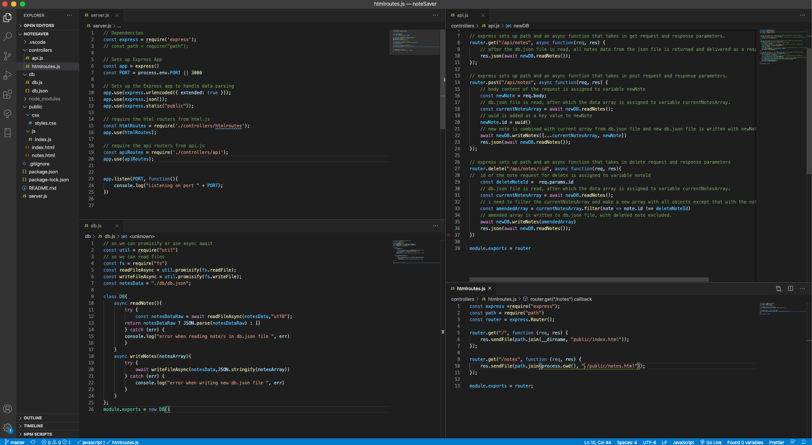

# noteSaver

## Write, save, and delete notes.  

  

## Table of Contents

* [Description](#description)
* [Installation](#installation)
* [Usage](#usage)
* [License](#license)
* [Contributing](#contribution)
* [Tests](#tests)
* [Questions](#questions)

## Description 

This application allows the user to write, save, and delete notes so they can keep track of todos, thoughts, etc. I made it to experiment with Express, a Node.js application framework. I utilized a local json file for the purpose of implementing the GET, POST, and DELETE aspects of the backend. My focus was less on the front-end aspects, and more on creating a simple database and connecting the front and back of the application with the various API request processes.  

## Installation

If you want to install this application locally on your computer, you will need to install the Express npm package, and the UUID npm package that are in the package.json file.

## Usage 

To use the application, simply click on the 'Get Started' button on the index page. This will take you through to the notes page where you will see an input placeholder, 'Note Title', in the center of the webpage. Below this is an input placeholder, 'Note Text'. Type your note title and text that you would like to save. When you have put text in both of these inputs, a save button icon will appear in the top right. Click this icon to save your note. The saved note will then appear in the list column on the left side of the page. Multiple notes can of course be saved. To refer back to a saved note and see its text, simply click on that note title. To delete a note, click on the trashcan button icon on the note you would like to delete. To clear a note in mid-writing, click the pencil button icon in upper right of the webpage. To go back to the index page, click the 'Note Taker' text in the upper left of the webpage. 

## License

This application is covered under a [MIT License](https://opensource.org/licenses/MIT).

## Contributing

Contributing to the necessary at this point, but I take feedback. My email address is below.

## Tests

No tests currently.

## Questions

Got questions? Feel free to contact me.  
Github username: [domjparker](https://github.com/domjparker)  
Email address: dominic.j.parker@gmail.com

---

© 2020, Dominic Parker. All Rights Reserved.

